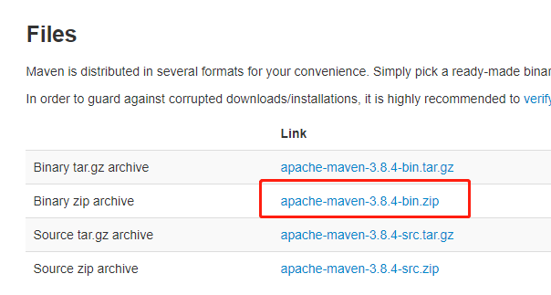
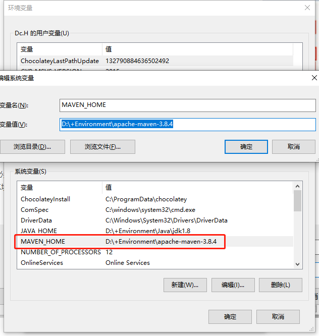
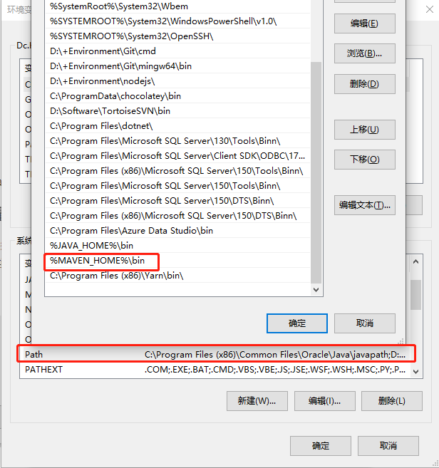
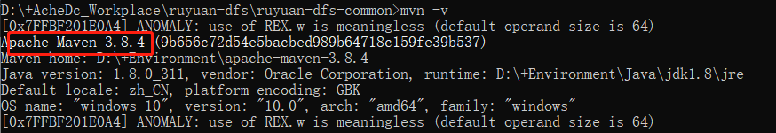
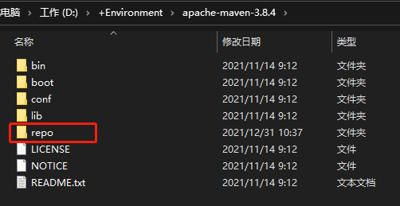
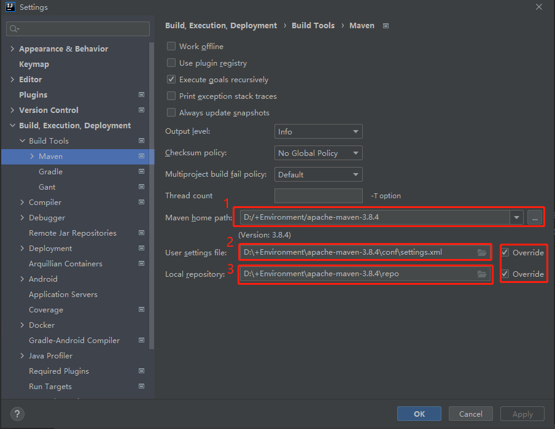
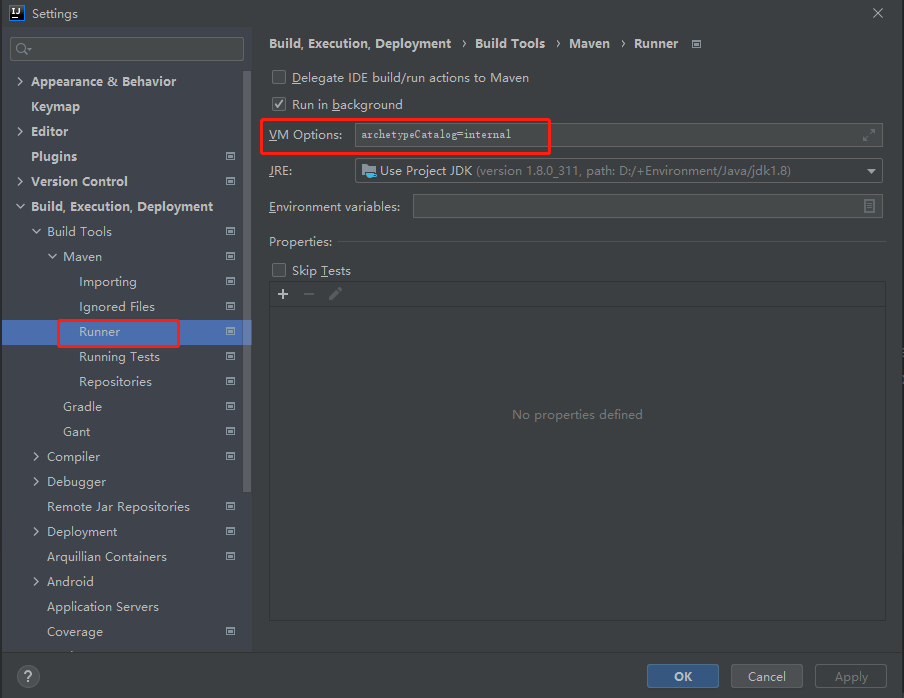

## Maven的安装与环境配置

1、下载与解压

> 首先下载maven,[下载地址](http://maven.apache.org/download.html)



2、配置环境变量

> 配置maven的环境变量：MAVEN_HOME



> 将MAVEN_HOME环境变量配置到Path环境变量中



> 测试是否安装成功：查询maven版本信息



3、配置本地仓库

> 在maven根目录下新建 /repo 



> 打开 %MAVEN_HOME%/conf/settings.xml 配置文件

```xml
<localRepository>D:/+Environment/apache-maven-3.8.4/repo</localRepository>
```

4、配置镜像

> 将阿里云的镜像配置到settings文件中

```xml
<mirrors>
  <mirror>
      <id>nexus-aliyun</id>
      <name>Nexus aliyun</name>
      <url>http://maven.aliyun.com/nexus/content/repositories/central/</url>
      <mirrorOf>central</mirrorOf>
    </mirror>
</mirrors>
```

## IDEA配置Maven

1、修改IDEA设置

> 打开 Settings... -> Build,Execution,Deployment -> Build Tools -> Maven
> 
> 修改如下配置



2、配置Maven-Runner下的VM options：`archetypeCatalog=internal`

> 备注一：maven项目创建时，会联网下载模版文件，比较大，使用archetypeCatalog=internal，不用下载，创建maven项目速度快
备注二：如果报错，改用 `-DarchetypeCatalog=internal`



## 参考文章

[MVN 环境配置](https://blog.csdn.net/jinmie0193/article/details/80284325)

[Maven（一）：Maven简介 ：安装与环境配置](https://blog.csdn.net/m0_53142956/article/details/120585147)

[Maven(二)：IDEA配置Maven](https://blog.csdn.net/m0_53142956/article/details/120590293)
