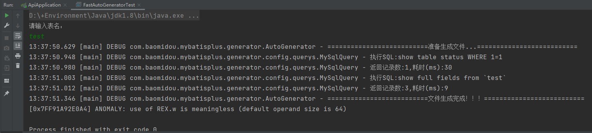
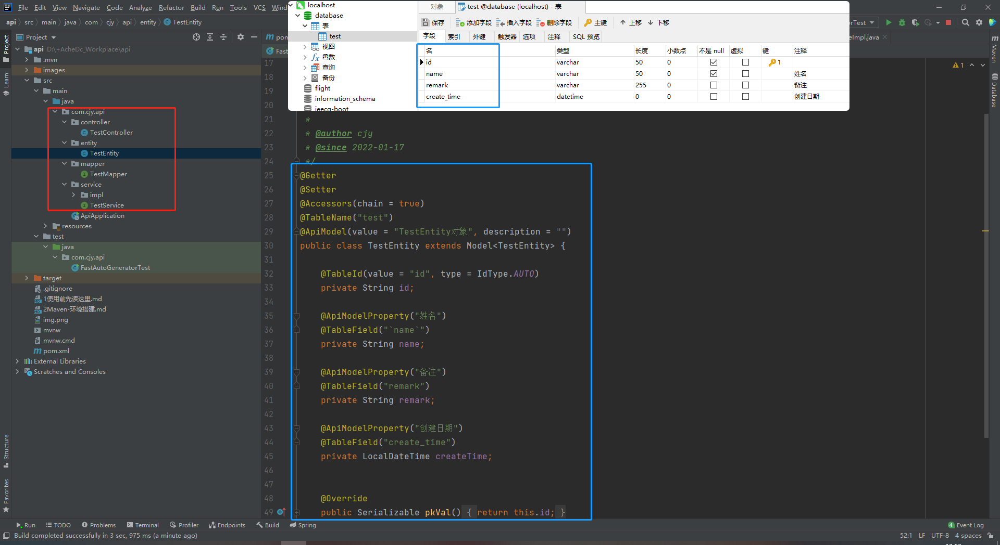
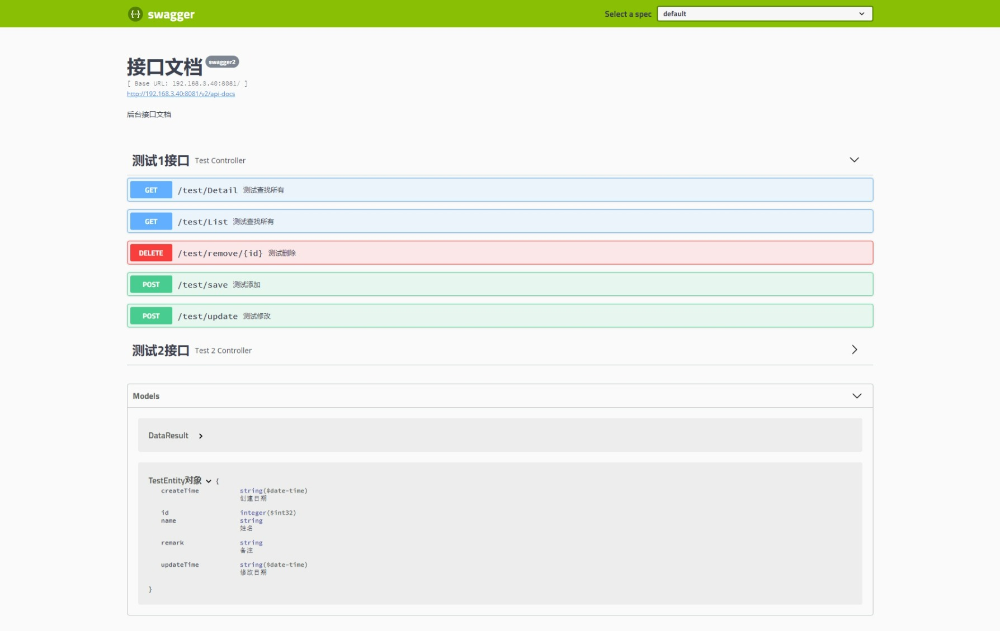
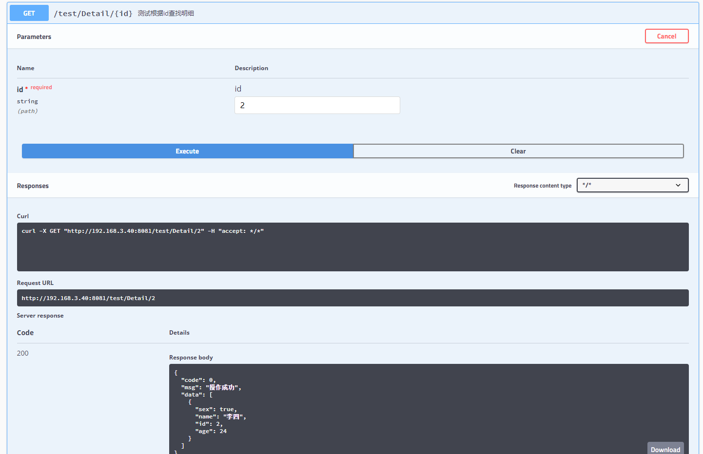
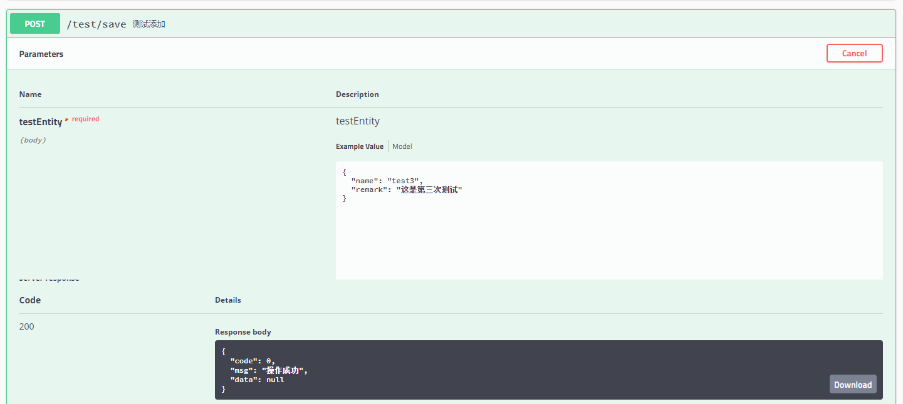
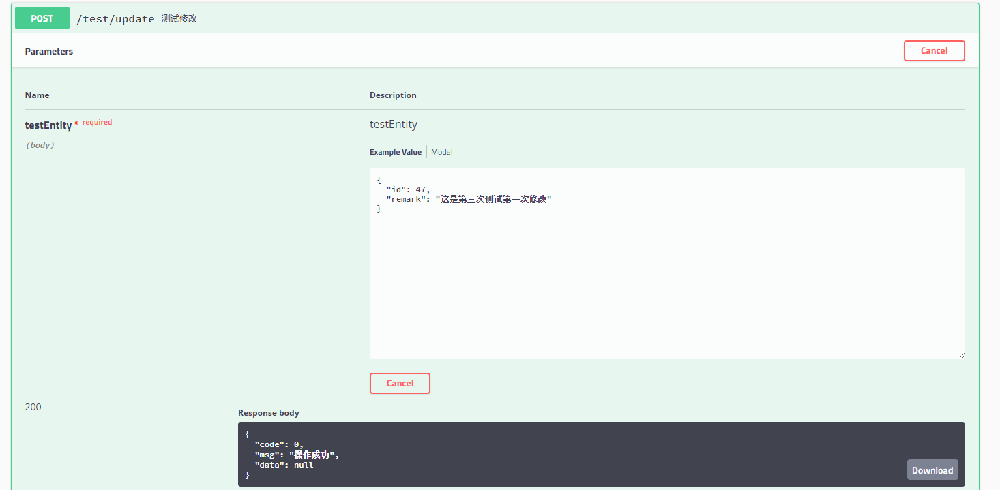
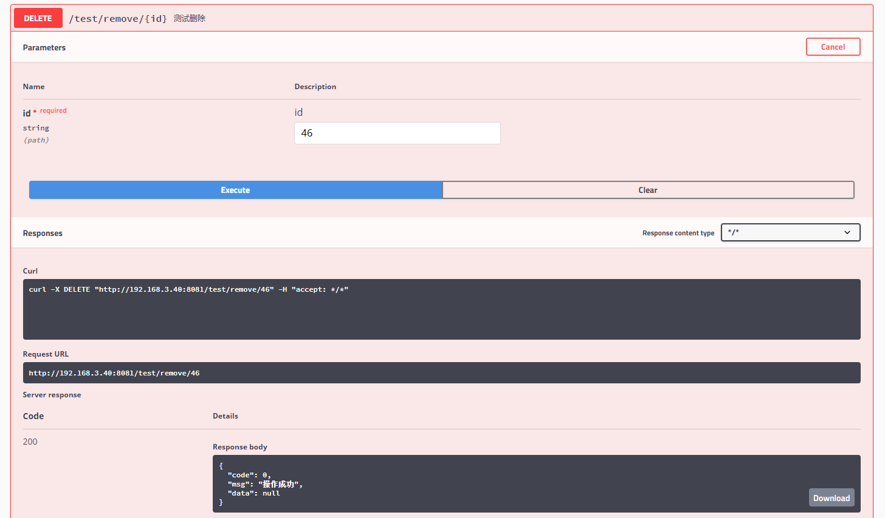

## 环境

+ jdk1.8
+ mysql5.7.26
  > 还原database.sql
+ maven3.x
  > maven环境搭建可以看 `READMAVEN.md`

## 代码生成
运行 [FastAutoGeneratorTest](src/test/java/com/cjy/api/FastAutoGeneratorTest.java)

输入想要生成的表即可！ `目前表只能一张一张生成`

注意：请将表结构确定后在生成，否则再次生成同一张表将会覆盖所有相关的文件！

如果确定要覆盖请注意备份！！！

如果确定要覆盖请注意备份！！！

如果确定要覆盖请注意备份！！！

> 例：
> 

> 生成文件路径： `src\main\java\com\cjy\api`
> 

## 代码编写

> ###Entity层 [例子](src/main/java/common/entity/TestEntity.java)
> 
> **用于存放对应表结构的实体**
> 
> 实体中成员需要引入注解（代码生成器会自动生成）
>
> ```java
> /**
> * 自动生成的注解
> */
> // 表名
> @TableName("test")
> // 主键，默认自增（建表时应注意）
> @TableId(value = "id", type = IdType.AUTO)
> // 表成员
> @TableField("`name`")
> 
> /**
> * 手动引入的注解
> */
> // 转化日期格式
> @JsonFormat(pattern = "yyyy-MM-dd HH:mm:ss", timezone = "GMT+8")
> // 在新增时自动填入值 `fill= FieldFill.INSERT`
> @TableField(value = "create_time", fill= FieldFill.INSERT)
> // 在修改时自动填入值 `fill = FieldFill.UPDATE`
> @TableField(value = "update_time", fill = FieldFill.UPDATE)
> 
> ```
> 
> 

> ###Controller层 [例子](src/main/java/client/controller/TestController.java)
> 
> **用于编写<u>增删改查</u>接口以及数据转换**
> 
> ```java
> /**
> * 定义在类上的常用注解
> */
> // 两者取一
> @Controller         // 返回页面 
> @RestController     // 返回JSON数据
> 
> // 定义接口的一级路由
> @RequestMapping("/a")
> 
> /**
> * 定义在方法上的常用注解
> */
> // 定义接口的二级路由
> @GetMapping("/b")     // Get方法: 查
> @PostMapping("/b")    // Post方法: 增，改 (一般用post即可)
> @PuttMapping("/b")    // Put方法: 增，改
> @DeleteMapping("/b")  // Delete方法: 删
> 
> /**
> * 定义在参数中的常用注解
> */
> // 从ajax接收data(JSON)
> @RequestBody Entity entity
> 
> // 从路由上接收id，如(/a/b/11)->id=11,一般用于根据id增删改查
> @PathVariable("id") String id
> 
> // 注入Service层方法
> // 注入逻辑 Controller <- Service <- Mapper
> @Autowired
> XxxService xxxService;
> ```
> 
> 

> ###Service层 [例子](src/main/java/client/controller/service/TestService.java)
> 
> **用于定义接口**
> 
> + 无需引入任何注解，只需定义接口
> + 除空返回值外(void)，一般用DataResult作返回值
> 
> ```java
> 
> ```
> 
> ###ServiceImpl层 [例子](src/main/java/client/controller/service/impl/TestServiceImpl.java)
> 
> **用于实现业务逻辑**
> 
> ```java
> /**
> * 定义在类上的常用注解
> * 必须写！
> * 必须写！
> * 必须写！
> * 使用代码生成器会自动生成
> */
> @Service  // 定义容器
> 
> /**
> * 定义在方法上的常用注解
> * 必须写！
> * 必须写！
> * 必须写！
> */
> @Override  // 重写方法
> 
> // 注入Mapper层方法
> // 注入逻辑 Controller <- Service <- Mapper
> @Autowired
> XxxMapper xxxMapper;
> ```
> 
> 

> ###Mapper层[例子](src/main/java/common/mapper/TestMapper.java)
> 
> **编写复杂sql语句（简单的sql一般不需要写，调用继承的方法即可）**
> 
> ```java
> /**
> * 定义在接口(interface)上的常用注解
> * 必须写！
> * 必须写！
> * 必须写！
> * 使用代码生成器会自动生成
> */
> @Mapper  // 定义容器
> 
> /**
> * 定义在方法上的常用注解
> * sql请先确定无误再copy过来使用即可
> * sql中可以使用连接符${}与占位符#{}传递参数
> */
> @Select("sql")  // 查
> @Update("sql")  // 改
> @Insert("sql")  // 增
> @Delete("sql")  // 删
> 
> 
> ```
> 
> 

> ###自定义返回值类型 [DataResult](src/main/java/common/common/utils/DataResult.java)
> 
> 每个接口（Controller）应按此类返回值
> ```json
> 返回值：
> {
>    "code": 0,
>    "msg": "success",
>    "data": {}
>  }
>  ```
> 
> 

> ###[接口文档Swagger-ui](http://192.168.3.40:8081/swagger-ui.html)
> **实体层** 与 **接口层** 都可以生成接口文档
> 
> 接口文档可以用来测试接口
> 
> 要引入接口文档，须在类名与属性名或方法名上引入注解
> 
> ```java
> /***/ 
> // 在类上定义
> @ApiModel(value = "TestEntity对象", description = "")
> // 在成员上定义
> @ApiModelProperty("姓名")
> 
> //Controller层
> // 在类上定义
> @Api(value = "测试接口",tags = "测试1接口")
> // 在方法上定义
> @ApiOperation("测试查找所有")
> ```
> 
> ####例子： 
> + [实体层](src/main/java/common/entity/TestEntity.java)
> + [接口层](src/main/java/client/controller/TestController.java)
> 
> ####效果：
> 
> 
> 
> 
> 
> 
> 
> 
> 
> 
> 
